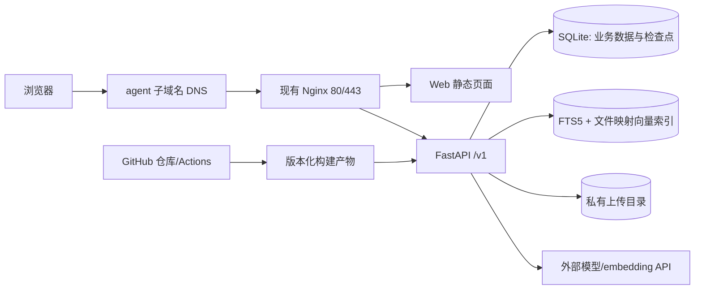

# 云服务器与 GitHub 发布方案 v0.3

状态：**路线 A 已选定，尚未部署应用**。已通过 `ssh aliyun` 只读核查服务器，未修改服务器或发布仓库。目标站点为 `https://agent.cuitopendoor.top`。

**2026-09-25 核查快照**：Ubuntu 22.04.5 LTS、2 vCPU、约 1.6 GiB RAM（检查时约 740 MiB 可用）、根分区 40 GiB（约 27 GiB 可用）、无 swap；Nginx 已占用 80/443 并服务多个现有站点，Certbot 已安装；未检测到 Docker、PostgreSQL 客户端。用户添加 A 记录后，本机 DNS 与 1.1.1.1 均解析 `agent.cuitopendoor.top` 为 `8.137.170.10`（TTL 600 秒）。容量与 DNS 状态会变化，上线前须重新核查。

**关键约束**：[Milvus 官方 Standalone 要求](https://milvus.io/docs/prerequisite-docker.md)至少 8 GiB RAM，当前服务器不满足。线上使用轻量检索和外部模型 API，不在服务器上运行 Milvus、本地 embedding/reranker 或本地大模型。未来资源变化时，再以实测结果决定是否扩展。

## 1. 目标拓扑

复用现有 Nginx，只新增 `agent.cuitopendoor.top` 虚拟主机，不抢占现有网站的 80/443。React 构建后的静态文件由 Nginx 提供；FastAPI 由 systemd 托管，只监听 `127.0.0.1` 上经核查空闲的端口。服务器不运行前端开发服务器。SQLite 数据库、向量索引及上传文件位于受限目录，仅由服务账号读写。

**选定的检索实现**：SQLite FTS5 保存预处理后的中英文检索文本，用 `bm25()` 做关键词召回；原始片段、来源和权限字段留在业务表。外部 embedding API 生成定维 float32 向量，存入版本化文件映射索引；查询时先按用户/课程范围取得允许的片段 ID，再在受限集合中计算余弦相似度，最后用 RRF 合并两路候选。中文分词、英文技术词和短查询的处理方式必须在 M1 评测集中验证。[SQLite FTS5 官方文档](https://www.sqlite.org/fts5.html)说明内置 BM25 的用法。索引规模、内存峰值和单请求延迟经负载测试后设硬上限；超过上限暂停入库并提示管理员，不让现有网站因索引增长而失稳。

**状态持久化**：业务记录和 LangGraph 检查点分别保存为 SQLite 数据库，单 API worker、限并发、事务写入与定期清理。LangGraph 官方将 SQLite checkpointer 定位于轻量演示/小项目，见[检查点文档](https://langchain-ai.github.io/langgraph/reference/checkpoints/)；这个线上站点按低并发作品演示验收，不声称具备高并发生产能力。保留 `RetrievalStore` 适配接口，便于本地评测其他后端；公开材料只陈述线上实际部署的后端。

## 2. 前置核查

在执行服务器变更前重新记录资源、已有服务和端口占用、Nginx 配置与 Certbot 续期状态、系统防火墙与云安全组、域名 DNS 托管商、模型服务的位置与费用上限。保留现有服务配置和备份，不覆盖其他站点。

`agent.cuitopendoor.top` 的 A 记录已添加并在两处 DNS 查询中解析成功。上线前再次确认解析结果与 80/443 连通，再核对现有 Certbot 证书管理与续期任务，为新 Nginx 虚拟主机配置 HTTPS。证书操作前先验证 Nginx 配置，避免影响现有站点。只有服务器实际配置 IPv6 且可达时才添加 AAAA。

## 3. 仓库、CI 与发布链路

1. 代码和文档放在 GitHub 仓库；公开仓库仅包含演示/获授权数据、`.env.example`，不提交 API key、真实简历、上传文件、数据库转储。
2. Pull Request 和主分支运行格式检查、类型检查、单元/集成测试、构建与密钥扫描。需要模型 API 的在线评测作为单独手动任务，常规 CI 使用 fake provider。
3. 给可演示版本打 tag，记录提交 SHA、依赖锁文件与评测报告版本。GitHub Actions 生成版本化 Web 静态文件和 API 源码/依赖清单；服务器以受限账号安装并由 systemd 管理 API。部署通过手动触发的 workflow 或经核对后的服务器命令进行；每次推送主分支不自动改线上。
4. 部署前用 SQLite 在线备份接口备份业务库和检查点库，同时备份上传文件、向量索引及配置。部署指定版本，执行数据库迁移，启动服务，运行健康检查和一条不含敏感数据的问答烟测，再切换对外流量。
5. 若健康检查失败，切回上一版构建产物和兼容的数据库结构；破坏性数据库迁移必须有单独回滚方案，不能仅靠替换代码或镜像回滚。

GitHub Actions 的触发与密钥配置以 [GitHub 官方文档](https://docs.github.com/en/actions/how-tos/write-workflows/choose-when-workflows-run/trigger-a-workflow)和[Secrets 文档](https://docs.github.com/en/actions/how-tos/write-workflows/choose-what-workflows-do/use-secrets)为准。服务器私密配置只保存在服务器受限权限文件或密钥服务中；CI 不打印密钥。发布账号采用最小权限 SSH 密钥，生产环境可设置审核门槛。

## 4. 运行配置与安全

- 反向代理转发 `/v1/` 到 FastAPI，其他路径到 Web；确认 SSE 不被缓存或缓冲，长连接超时大于预期单任务时长，断线后可凭任务 ID 查状态。若使用 Nginx，在 SSE 路由禁用响应缓冲或由后端设置 `X-Accel-Buffering: no`，参见 [Nginx 官方代理文档](https://nginx.org/en/docs/http/ngx_http_proxy_module.html#proxy_buffering)。
- Web 与 API 使用同一站点域名，避免跨域和 Cookie 配置复杂化；API 不信任客户端传入的角色/租户 ID。
- 保持现有网络策略，新增 API 端口仅绑定 `127.0.0.1`，不对公网开放；不因本项目修改其他服务的端口或访问策略。SSH 管理方式按当前有效配置保留。
- 设置 CPU/内存限制、日志轮转、上传配额、任务超时、速率限制和模型费用上限；日志默认不记录简历及问答原文。
- 健康检查分 `live`（进程可响应）与 `ready`（数据库、向量库等依赖可用）；对证书到期、磁盘空间、5xx、任务失败率、备份失败设置告警。
- 每日备份并保留有限历史；至少做一次从备份恢复到隔离环境的演练。用户删除请求覆盖 SQLite 记录、上传文件、向量索引与可识别日志，并记录完成状态。删除与更新后重建索引，防止旧向量残留。

上线前进行并发 1、2、4 的短时负载测试，记录新服务与现有网站的 RSS、总内存、p95 延迟和失败数；若影响现有站点，降低入库规模/并发或暂停上线。负载测试不在现有服务器上运行本地模型。

## 5. 上线验收

| 检查项 | 通过条件 |
| --- | --- |
| 域名与 HTTPS | `agent.cuitopendoor.top` 解析到目标服务器，浏览器 HTTPS 有效，HTTP 跳转 HTTPS |
| 功能 | 四条已宣布支持的业务路径可在网页完成，引用和审核状态正确显示 |
| 流式与恢复 | SSE 可接收事件；断线后可查最终状态；服务器重启后待审核任务仍可恢复 |
| 数据与权限 | API 仅本机监听；SQLite/索引/文件目录仅服务账号可访问；跨用户资料访问被拒绝；删除请求可验证 |
| 可运维 | 备份恢复演练成功；能部署指定版本并回滚；健康检查和告警可见 |
| 可复现 | GitHub tag、Web/API 构建产物版本、演示数据版本、评测报告与线上版本相互对应 |

## 6. 实施顺序

先在本机完成 M1 问答闭环，再演练 systemd、Nginx 代理、SQLite 备份与恢复。M4 时准备生产配置并进行资源、安全和数据审计；M5 时发布 GitHub 仓库、打版本 tag、在 `agent.cuitopendoor.top` 上线并验收。Nginx 已有站点，任何配置变更都必须先备份、语法检查并验证原站点正常。
