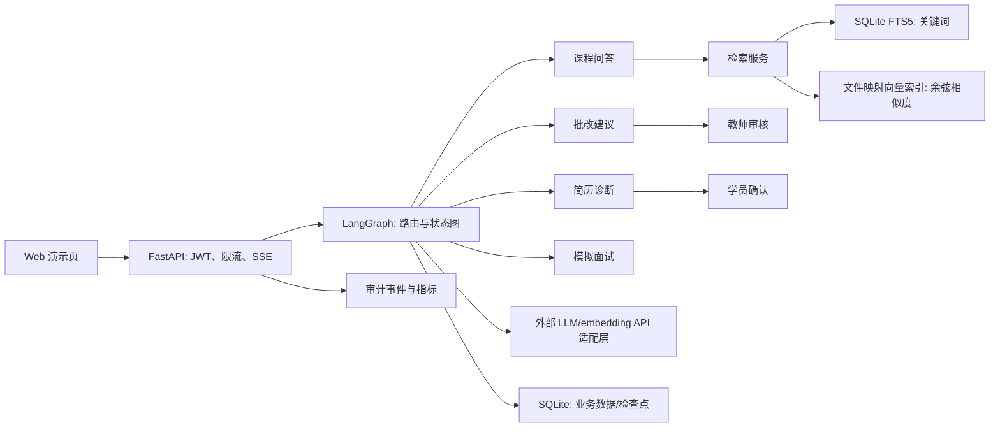

# MEduAgent 项目方案 v0.1

更新日期：2026-09-25。状态：设计基线；M1 本地检索预览原型已实施，完整 M1 尚未验收，详见 [本地原型说明](M1_LOCAL_MVP.md)。此文件是后续实现与验收的基线；调整时记录原因与证据。

## 1. 项目定位与边界

**目标用户**：IT 培训机构中的学员与教师。学员需要从课程资料定位答案、获得简历建议和面试练习；教师需要有证据可查、可复核的作业批改辅助。

**核心展示能力**：把多业务 Agent 的路由、工具调用、状态持久化、人工审核、RAG 评测和服务化部署连成完整工程闭环。不能只做四套提示词页面。

**交付定义**：新环境按文档启动后，使用公开或自制的演示资料，可以完成四条演示路径；仓库保存自动化测试、评测集、运行说明、架构图、演示截图或视频以及实际测得的指标。最终公开在 GitHub，并部署至用户云服务器的 `agent` 子域名，执行 [部署方案](DEPLOYMENT_PLAN.md)中的上线验收。若资源有限，先完成可运行的问答 MVP，再逐步扩展；未实现功能在 README 中保持未完成状态。

**明确边界**：

- 不接入真实学校教务系统；不用真实学生隐私、未授权题库和非公开简历做演示数据。
- 客观题可按答案自动评分；主观题仅生成有证据的评分建议，教师确认后才形成最终成绩。
- 简历诊断不伪造经历；建议必须区分“从简历提取的事实”和“可改写建议”。
- 面试反馈是练习建议，不做录用判断；课程问答证据不足时明确拒答或请求补充资料。
- 图片中“94.5% 路由准确率、98.5% 结构化输出成功率、Recall@5 从 81.3% 到 92.7%”均未验证，不能写入项目成果。

## 2. 框架选型

| 方案 | 相关能力 | 在本项目中的结论 |
| --- | --- | --- |
| LangGraph | 显式状态图、持久化检查点、`interrupt` 暂停与恢复 | 主编排层；适合展示流程控制和教师复核 |
| CrewAI Flows | 结构化状态和流程持久化 | 可作为对照原型；主系统不同时混入两套编排运行时 |
| OpenAI Agents SDK | Handoff、guardrails、tracing | 作为设计参考；当前官方文档说明新项目优先 Agents API，且本项目希望掌握本地工作流与模型适配 |
| Microsoft Agent Framework | Agent 与 Workflow 组合 | 作为对照；本项目使用 Python 与 LangGraph 保持实现焦点 |

选择依据来自框架官方文档：[LangGraph 概览](https://docs.langchain.com/oss/python/langgraph/overview)、[持久化](https://docs.langchain.com/oss/python/langgraph/persistence)、[中断恢复](https://docs.langchain.com/oss/python/langgraph/interrupts)、[CrewAI Flows](https://docs.crewai.com/en/concepts/flows)、[OpenAI Agents SDK](https://openai.github.io/openai-agents-python/)、[Microsoft Agent Framework](https://learn.microsoft.com/en-us/agent-framework/concepts/)。框架功能与版本可能变化，实施时锁定依赖版本并重新验证 API。

## 3. 产品流程

| 流程 | 输入 | 系统动作 | 输出与审核点 |
| --- | --- | --- | --- |
| 课程问答 Agent | 问题、课程范围 | 改写指代、检索、重排、证据校验、生成 | 带文档标题/页码/片段 ID 的答案；证据不足时拒答 |
| 简历诊断 Agent | 用户授权上传的简历、目标岗位 | 提取经历、逐项对照岗位、找出表达与证据缺口 | 事实清单、逐条修改建议、待用户确认的改写草稿 |
| 批改 Agent | 题目、标准答案/评分 rubric、学员作答 | 客观题规则评分；主观题按 rubric 列证据与建议分 | 批改建议、逐条评分依据；主观题进入教师确认 |
| 模拟面试 Agent | 岗位、难度、轮次、回答 | 问题生成、追问、按 rubric 反馈 | 逐轮记录与总结；用户可查看/删除会话 |

路由优先使用**明确选择的业务入口**；通用聊天入口再使用意图分类。低置信度、多意图或涉及评分发布时转人工/请求澄清。每个 Agent 只拥有必要工具和数据权限。

## 4. 系统架构

下图是已选定的轻量线上架构；大模型与 embedding 由外部 API 提供，服务器只负责业务编排与小规模检索。



**工作流状态**：`thread_id`、`user_id`、`task_type`、`input_ref`、`route_reason`、`evidence_ids`、`draft_output`、`review_status`、`final_output`、`error`、`prompt_version`、`model_version`。大文档、简历原文不放入检查点，状态只保存引用；检查点需设置保存期限与清理任务。

**路由图**：输入校验 → 业务路由 → 对应子图 → 结构化输出校验 → 证据/风险校验 → 必要时 `interrupt` 人工审核 → 写入结果 → 返回。节点最大重试次数有限，失败有明确状态；外部副作用放在审核之后，恢复执行时使用幂等键，避免节点重跑造成重复写入。[LangGraph 官方中断文档](https://docs.langchain.com/oss/python/langgraph/interrupts)说明恢复时中断所在节点会从头重跑。

**RAG**：文档上传 → 类型/大小校验 → 提取文本与页码 → 按标题/段落切分并保留来源 → 去重及版本号 → 外部 API 向量化 → SQLite FTS5 关键词召回 + 文件映射向量余弦召回 → RRF 合并 → 可选外部重排 → 取证据片段 → 带引用生成 → 引用映射校验。中文分词、英文技术词和短查询在评测集上确定处理方式，给索引大小和查询内存设硬上限。Milvus/BGE-M3/BGE reranker 可以作为资源充足环境的可选对照实验；[Milvus Standalone 至少 8 GiB RAM](https://milvus.io/docs/prerequisite-docker.md)，当前线上服务器不部署它们。线上检索指标必须按实际 SQLite/外部 embedding 组合报告。

**数据存储**：SQLite 保存用户、文档元数据、题目/rubric、审核记录和会话索引；LangGraph 检查点放在单独 SQLite 文件；向量使用版本化文件映射索引，原文件放受控目录。部署为单 API worker 并限制并发，按低并发作品演示验收；备份使用 SQLite 在线备份接口，不直接复制正在写入的数据库文件。上传文件与检索条目以 `tenant_id`/`owner_id` 隔离，先过滤权限再计算相似度；删除资料时同步删除记录、文件、索引条目与可识别日志。

**模型适配**：统一 `generate` / `stream` / `embed` / `rerank` 接口；默认 DeepSeek 生成、百炼向量化，火山方舟作为独立生成对照，CI 使用确定性 fake provider。`rerank` 为可选能力，基线评测后再决定启用。API key 只从服务器受限配置读取，记录模型 ID、向量维度、参数、token 用量、延迟和错误；模型或维度改变时重建索引。不要把简历或答案全文写入常规日志。详细配置与验收见[模型服务决策](MODEL_PROVIDER_PLAN.md)。

**前后端**：FastAPI + Pydantic 请求校验、JWT 认证、SSE 流式事件（`status`/`token`/`evidence`/`review_required`/`done`/`error`）；React + Vite 轻量演示页展示引用、审核状态、错误重试和历史。SSE 实现参照 [FastAPI 官方文档](https://fastapi.tiangolo.com/tutorial/server-sent-events/)。

**安全边界**：服务端从 JWT 确定用户和教师角色，不接受客户端自报的 `owner_id` 或审核人身份；上传限制文件类型、体积和解析时间，拒绝可执行内容；文档内容仅作为检索数据，不获得工具指令权限；工具使用白名单并限制网络目标；敏感操作写审计事件。演示环境配置速率限制、最大 token 和任务超时。对越权检索、提示注入、恶意文件、重复审核和断线重连设置回归用例。

## 5. 接口与数据契约（初版）

| 接口 | 作用 | 核心字段 |
| --- | --- | --- |
| `POST /v1/documents` | 上传课程资料 | 文件、课程 ID；返回文档 ID、解析状态 |
| `POST /v1/tasks` | 创建问答/诊断/批改/面试任务 | `task_type`、`payload`、`idempotency_key`；返回任务 ID |
| `GET /v1/tasks/{id}/events` | 流式观察执行 | SSE 事件，含稳定事件 ID；断线可查询任务状态 |
| `GET /v1/tasks/{id}` | 查询状态/结果 | `status`、`result`、`citations`、`review` |
| `POST /v1/tasks/{id}/review` | 人工审核与恢复 | `decision`、`edited_result`、版本号；审核人来自 JWT |
| `DELETE /v1/users/me/data` | 删除个人演示数据 | 删除任务、文件、向量与会话 |

通用返回必须包含 `request_id`、`task_id`、`schema_version`、`status`。引用包含 `document_id`、`document_version`、`chunk_id`、`page`、`quote`。结构化结果采用 Pydantic，解析失败只有限重试，失败仍返回错误状态，不能把不合格 JSON 当成功。

## 6. 评测设计：先冻结数据与口径，再报告数字

评测集由可公开的课程资料和自制/授权样例组成。开发集用于提示词、切分、检索参数调整；冻结测试集仅用于阶段验收。每条样本记录输入、标准路由、允许证据、期望行为、难度标签与构建来源；对于简历和主观题，由两名标注者复核分歧。保存数据集版本和 commit hash。

| 维度 | 指标与定义 | 基线/报告方式 |
| --- | --- | --- |
| 路由 | 正确路由数 / 有标签请求数；按四类和多意图分层 | 规则路由基线；给出混淆矩阵与样本量 |
| 结构化输出 | 首次合规率、有限重试后合规率；分母为实际生成请求 | 记录失败类型，不仅报告最终成功率 |
| 检索 | Recall@5 = 前 5 片段含任一人工标注相关片段的问题数 / 有相关片段的问题数 | BM25、dense、混合、混合+重排同集对照 |
| 问答 | 引用可定位率、证据支持率、无答案拒答率 | 人工盲评；记录错误引用和幻觉案例 |
| 批改 | 客观题评分一致率；主观题 rubric 项一致性与教师改动率 | 与教师标注比较，不把模型建议当真值 |
| 面试/简历 | rubric 覆盖率、事实虚构率、用户反馈 | 人工样本复核；不声称就业效果 |
| 工程 | p50/p95 延迟、失败率、单任务 token/费用、恢复成功率、租户越权测试 | 固定硬件、并发、模型配置与样本量 |

**目标设定**：MVP 阶段优先实现可复现的评测管线与零越权回归；性能阈值在首轮基线测量后冻结。图片中的百分比不能预设为验收门槛。任何改进只在相同测试集、相同 top-k 和标注规则下比较，并报告原始分子分母及配置。

## 7. 迭代里程碑

下表按个人兼职开发估算 8–11 周，具体排期以可用时间和模型资源调整。阶段完成看验收证据，不以日期代替完成状态。

| 阶段 | 预计投入 | 完成条件 | 主要产物 |
| --- | --- | --- | --- |
| M0 需求与数据 | 1 周 | 公开/自制样例、权限与许可清单、评测标注规范、依赖锁定 | `docs/`、样例数据清单、架构决策 |
| M1 问答 MVP | 2–3 周 | 文档导入、可引用问答、无证据拒答、API/SSE、单机启动与测试 | 可演示服务、问答评测报告 |
| M2 编排与持久化 | 1 周 | 显式路由、检查点恢复、人工审核、幂等/错误路径 | 工作流图、断点恢复演示 |
| M3 四业务闭环 | 2–3 周 | 简历、批改、面试流程与各自 rubric；权限隔离 | 四条端到端演示与失败案例 |
| M4 工程化 | 1–2 周 | 完成 systemd + Nginx 部署、配置样例、CI、负载与安全测试、用户数据删除、备份恢复演练 | 部署指南、测试报告、演示素材 |
| M5 公开发布 | 1 周 | 许可/数据/密钥审计、README 与指标证据核对、GitHub 发布、`agent` 子域名上线验收 | GitHub release、线上站点与真实项目经历材料 |

每阶段遵循：实现 → 测试 → 记录失败案例 → 更新文档 → 再扩范围。M1 的单条问答闭环是优先投入点；四类 Agent 同时铺开会稀释可验证成果。

## 8. 仓库结构（实施目标）

```text
app/
  api/              # FastAPI 路由与认证
  workflows/        # LangGraph 主图和四个业务子图
  retrieval/        # 入库、检索、重排、引用
  providers/        # LLM/embedding/reranker 适配
  domain/           # Pydantic 契约与业务规则
  storage/          # 业务存储、检索后端适配、文件存储
web/                # 轻量演示界面
eval/               # 标注集、指标脚本与版本化报告
tests/              # 单元、集成、端到端测试
docs/               # 方案、架构决策、部署与演示
.env.example
README.md
```

## 9. 发布与简历表述

公开前检查：密钥扫描、个人信息和文档许可、开源依赖许可、版本化构建、冷启动说明、测试结果、演示视频/截图、问题清单。GitHub 仓库公开后用 tag 标记可演示版本，线上站点部署相同版本的构建产物。域名、HTTPS、备份、回滚和上线检查详见 [部署方案](DEPLOYMENT_PLAN.md)。

简历只写实际完成内容。例如 M1 完成后可写“基于 LangGraph/FastAPI 实现带来源引用的课程资料问答与 SSE 流式接口，构建固定评测集比较 BM25、dense 与混合检索”；只有取得可复现数据后，才补充准确率、召回率、延迟及相应分母和测试条件。

## 10. 待确认但不阻塞 M0/M1 的选项

- DeepSeek、百炼、火山方舟已列入模型接入计划；待确认实际账号地域、可用模型和月度费用上限，不在仓库中保存密钥。
- 是否已有获授权的 IT 课程资料；没有则使用自制的小型演示教材与公开许可文档。
- 希望突出后端工程、RAG 检索还是多 Agent 编排；当前默认以“可评测的后端 Agent 平台”为主线。

## 11. 下一步

从 M0 开始：建立许可明确的样例教材和任务样本，冻结首批评测口径，确定模型适配与本地启动方式；随后只实现问答 MVP，跑通真实 API 请求和可复现评测，再决定其余模块的细化顺序。
